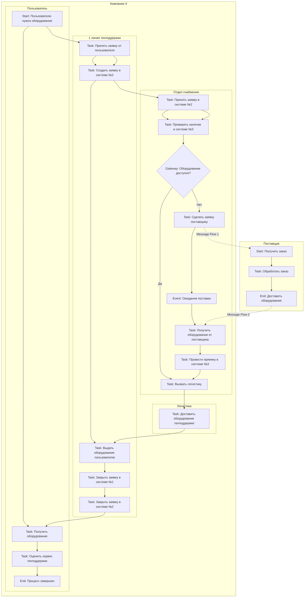
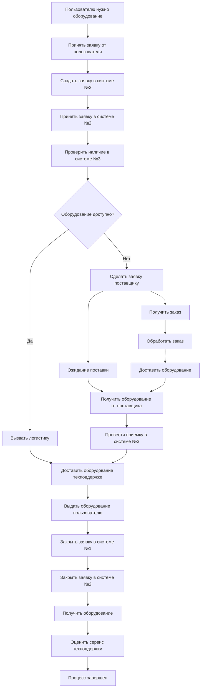

# BPMN Process Model - Mermaid Diagram

## Mermaid Diagram Visualization

## Alternative Flow View

## Process Elements Summary

### Events

- **Start Event**: "Пользователю нужно оборудование"
- **Intermediate Event**: "Ожидание поставки"
- **End Event**: "Процесс завершен"

### Tasks

- **User Tasks**: Получить оборудование, Оценить сервис
- **Support Tasks**: Принять заявку, Создать заявку, Выдать оборудование, Закрыть заявки
- **Supply Tasks**: Принять заявку, Проверить наличие, Вызвать логистику, Заказать у поставщика, Получить от поставщика, Провести приемку
- **Logistics Tasks**: Доставить оборудование
- **Supplier Tasks**: Получить заказ, Обработать заказ, Доставить оборудование

### Gateways

- **Exclusive Gateway**: "Оборудование доступно?" (Да/Нет)

### Message Flows

- **Message Flow 1**: Заказ поставщику
- **Message Flow 2**: Доставка от поставщика
